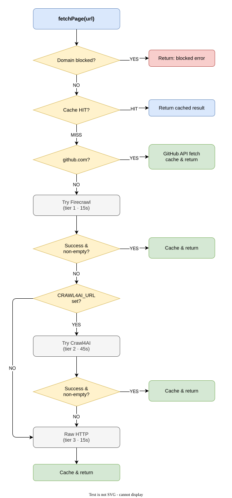

# searxng-mcp

[](https://claude.ai/code)
[](https://github.com/iori7295/searxng-mcp/actions/workflows/ci.yml)
[](https://opensource.org/licenses/MIT)

An MCP server for private web search via a self-hosted [SearXNG](https://github.com/searxng/searxng) instance. Results are reranked by a local ML model (FlashRank, Jina, or TEI), with **domain-aware MMR diversification** to avoid same-source bias. Full-page content is fetched via a three-tier cascade, **cross-query knowledge** surfaces previously fetched content in future searches, and an optional LLM provides query expansion and synthesized summaries. Supports optional **hybrid vector search** with LanceDB + TEI embeddings for semantic chunk retrieval. **Infoboxes, answers, and suggestions** from SearXNG are surfaced as structured data.

Designed for use with Claude Code and LibreChat agents that need web search without sending queries to a third-party search API.

Built with [Claude Code](https://claude.ai/code) using the multi-agent workflow from [homelab-agent](https://github.com/iori7295/homelab-agent) — the same platform that uses searxng-mcp in production for AI-assisted research.

## Tools

| Tool | Description | Key Parameters |
|------|-------------|----------------|
| `search` | Search via SearXNG with local reranking. Fetches a wider result pool, reranks by relevance, diversifies by domain (MMR), surfaces infoboxes/answers/suggestions, and enriches with previously fetched content. | `query`, `num_results` (1–30), `category`, `time_range`, `domain_profile`, `expand` |
| `search_and_fetch` | Search, rerank, then fetch full content of the top result(s) using the fetch cascade (Firecrawl → Crawl4AI → raw HTTP + Defuddle/Readability). | `query`, `category`, `time_range`, `fetch_count` (1–3), `domain_profile`, `expand` |
| `search_and_summarize` | Search, fetch top results, then synthesize a summary with citations via LLM. Falls back to raw fetched content if the LLM is unavailable. | `query`, `fetch_count` (1–5), `category`, `time_range`, `domain_profile`, `expand` |
| `vector_search` | Search previously fetched pages by semantic similarity. Uses hybrid BM25+vector search with reranking. Returns the most relevant chunks, drastically reducing LLM token usage. Requires `ENABLE_VECTOR_STORE=true` and running TEI services. | `query`, `top_k` (1–20), `domain`, `since_days` |
| `fetch_url` | Fetch and extract readable markdown from any public URL. GitHub URLs use the GitHub API (Issues/PRs include body + comments + reactions); PDF URLs are parsed via `pdf-parse`; all others use the fetch cascade (Firecrawl → Crawl4AI → raw HTTP + Defuddle/Readability extraction). Use `start_index` to read beyond the 8,000-char window; use `depth` (2) to follow linked pages. Supports `mode` parameter: `full` (default), `chunks`, or `summary` (LLM-generated). | `url`, `domain_profile`, `start_index`, `depth`, `mode` |
| `clear_cache` | Purge the search cache, fetch cache, or both. Useful when researching fast-moving topics where cached results may be stale. | `target` (`search`, `fetch`, `all`) |

### Parameters

**`category`** — `general` (default), `news`, `it`, `science`

**`time_range`** — `day`, `week`, `month`, `year` — limits results by publication date. Omit for all-time results.

**`fetch_count`** — number of top reranked results to fetch full content for (default `1`, max `3` for `search_and_fetch`; default `3`, max `5` for `search_and_summarize`).

**`domain_profile`** — apply a named domain filter profile: `homelab` (surfaces self-hosted/Linux docs) or `dev` (surfaces Stack Overflow, MDN, npm). Omit for default filters.

**`expand`** — when `true`, rewrites the query via LLM before searching to improve recall. Requires `LLM_BASE_URL`. Defaults to the `EXPAND_QUERIES` env var value.

## Architecture

```
MCP client (stdio)
      │
      ▼
  searxng-mcp ──────────────→ Valkey ($VALKEY_URL)          → result cache (search 1h, fetch 24h)
      │
      ├── expand (optional) →  LLM ($LLM_BASE_URL)          → rewritten queries
      ├── search ───────────→ SearXNG ($SEARXNG_URL)        → raw results
      ├── rerank ───────────→ Reranker ($RERANKER_URL)      → ranked results
      │                       (TEI / Jina / FlashRank; falls back to SearXNG order)
      ├── fetch content ────┬→ GitHub API (github.com)      → markdown (Issues/PRs + comments + reactions)
      │                     ├→ Firecrawl ($FIRECRAWL_URL)   → page markdown (tier 1)
      │                     ├→ Crawl4AI ($CRAWL4AI_URL)     → page markdown (tier 2, opt.)
      │                     ├→ pdf-parse (application/pdf)  → page text (tier 3, auto)
      │                     ├→ Raw HTTP + Defuddle          → page text (tier 4)
      │                     └──→ Readability fallback       → plain text (tier 4b)
      ├── index (opt.) ─────→ TEI embed + LanceDB           → hybrid vector store (auto on fetch)
      ├── vector_search ────→ LanceDB hybrid (BM25+vector)  → reranked chunks → LLM
      └── summarize (opt.) →  LLM ($LLM_BASE_URL)            → synthesized summary



SearXNG is required. Firecrawl, Valkey, the LLM, TEI, and LanceDB are optional — the server degrades gracefully when any of these are unavailable. The fetch cascade extracts readable content via Defuddle (Tier 3a) with a Readability fallback (Tier 3b), so even raw HTTP produces clean markdown.

## Transport

stdio (compatible with Claude Code MCP plugin and LibreChat `stdio` config).

## Prerequisites

- Node.js 20+
- pnpm (or npm)
- A running [SearXNG](https://github.com/searxng/searxng) instance (required)
- A running [Firecrawl](https://github.com/mendableai/firecrawl) instance (recommended — falls back to Defuddle/Readability extraction without it)
- A running reranker exposing a Jina-compatible `/v1/rerank` or TEI `/rerank` endpoint (optional)
- A running [Valkey](https://valkey.io/) or Redis-compatible instance (optional, for result caching)
- An OpenAI-compatible API endpoint (optional, for query expansion and summarization)
- [TEI](https://github.com/huggingface/text-embeddings-inference) embedding + rerank services + [LanceDB](https://lancedb.github.io/lancedb/) (optional, for hybrid vector search)

### SearXNG

SearXNG must have JSON output format enabled. In `settings.yml`:

```yaml
search:
  formats:
    - html
    - json
```

### Reranker

Supports both Jina-compatible `/v1/rerank` (FlashRank) and HuggingFace TEI `/rerank` endpoints. The server auto-detects which format to use. See the [`docker/reranker/`](https://github.com/iori7295/homelab-agent/tree/main/docker/reranker) reference in [homelab-agent](https://github.com/iori7295/homelab-agent) for a lightweight FlashRank setup. For TEI:

```bash
docker run -d -p 8081:80 ghcr.io/huggingface/text-embeddings-inference:cpu-arm64-1.9 \
  --model-id BAAI/bge-reranker-base
```

### Firecrawl

Any Firecrawl-compatible instance works. The local [firecrawl-simple](https://github.com/mendableai/firecrawl/tree/main/apps/api) deployment is sufficient. Set `FIRECRAWL_API_KEY` if your instance requires authentication (defaults to `placeholder-local` for local deployments that skip auth).

### Valkey / Redis

Any Redis-compatible instance. Valkey is recommended. Search results are cached for 1 hour; fetched pages for 24 hours. If unavailable, the server operates without caching.

### LLM (OpenAI-compatible)

Required for `expand` and `search_and_summarize`. Any OpenAI-compatible chat completions endpoint works — DeepSeek, OpenCode, Bifrost, LiteLLM, Ollama (v1 compat mode), etc. Set `LLM_BASE_URL` to your endpoint (including `/v1` path).

### Vector store (optional)

Enables hybrid BM25+vector search via `vector_search` tool and automatic chunk indexing on fetch. Requires two TEI containers and LanceDB:

```bash
# TEI embedding service
docker run -d -p 8080:80 -v tei-data:/data \
  ghcr.io/huggingface/text-embeddings-inference:cpu-arm64-1.9 \
  --model-id intfloat/multilingual-e5-small

# TEI reranker (also used by `search`/`search_and_fetch` tools)
docker run -d -p 8082:80 -v tei-data:/data \
  ghcr.io/huggingface/text-embeddings-inference:cpu-arm64-1.9 \
  --model-id BAAI/bge-reranker-base
```

Set `ENABLE_VECTOR_STORE=true`, `EMBEDDING_URL=http://localhost:8080`, `RERANKER_URL=http://localhost:8082` to enable. When a page is fetched via `search_and_fetch` or `fetch_url`, it is automatically chunked, embedded, and upserted to the LanceDB store (fire-and-forget).

## Configuration

All service URLs are configurable via environment variables.

| Variable | Default | Description |
|----------|---------|-------------|
| `SEARXNG_URL` | `http://localhost:8081` | SearXNG instance URL |
| `FIRECRAWL_URL` | `http://localhost:3002` | Firecrawl instance URL |
| `RERANKER_URL` | `http://localhost:8787` | Reranker instance URL (TEI `/rerank` or Jina `/v1/rerank`) |
| `FIRECRAWL_API_KEY` | `placeholder-local` | Firecrawl API key (if required) |
| `GITHUB_TOKEN` | *(unset)* | GitHub personal access token — increases rate limit from 60 to 5,000 req/hour |
| `LLM_BASE_URL` | *(unset)* | OpenAI-compatible API base URL — required for `expand` and `search_and_summarize`. Falls back to `OLLAMA_URL` |
| `LLM_API_KEY` | *(unset)* | API key for the LLM endpoint. Falls back to `OLLAMA_API_KEY` |
| `LLM_MODEL_EXPAND` | `deepseek-v4-flash` | Model name for query expansion |
| `LLM_MODEL_SUMMARY` | `deepseek-v4-flash` | Model name for summarization |
| `VALKEY_URL` | `redis://localhost:6379` | Redis-compatible URL — enables result caching |
| `CACHE_TTL_SECONDS` | `3600` | Search result cache TTL in seconds |
| `FETCH_CACHE_TTL_SECONDS` | `86400` | Fetched page cache TTL in seconds |
| `LOG_LEVEL` | `info` | Pino log level: `trace`, `debug`, `info`, `warn`, `error`, `fatal` |
| `EXPAND_QUERIES` | `false` | Set to `true` to enable query expansion globally |
| `SEARCH_MIN_INTERVAL_MS` | `500` | Minimum interval between SearXNG requests (rate limiting) |
| `CHUNK_MAX_SIZE` | `800` | Max characters per chunk (`summarizePages`) |
| `RERANK_RECENCY_WEIGHT` | `0.15` | Recency boost weight (0 = disabled, 1 = equal to relevance) |
| `ENABLE_VECTOR_STORE` | `false` | Enable LanceDB + TEI hybrid vector search |
| `EMBEDDING_URL` | `http://localhost:8080` | TEI embedding service URL |
| `EMBEDDING_MODEL` | `intfloat/multilingual-e5-small` | Embedding model name (passed to TEI) |
| `EMBEDDING_DIM` | `384` | Embedding dimension (must match model) |
| `LANCEDB_PATH` | `./data/lancedb` | Path to LanceDB database directory |
| `VECTOR_CHUNK_SIZE` | `500` | Chunk size for vector store indexing |
| `VECTOR_CHUNK_OVERLAP` | `80` | Chunk overlap for vector store indexing |
| `LLM_CONTEXT_BUDGET` | `4000` | Token budget for LLM summarization input |

A reference `.env.example` is provided in the repository root — copy it to get started:

```bash
cp .env.example .env
```

## Install

### npm (recommended)

```bash
npm install -g @iori7295/searxng-mcp
```

Or run directly with `npx`:

```bash
npx @iori7295/searxng-mcp
```

### From source

```bash
git clone https://github.com/iori7295/searxng-mcp.git
cd searxng-mcp
pnpm install
pnpm build
```

Output: `build/src/index.js`

## MCP Client Configuration

### Claude Code (CLI)

The recommended approach uses `claude mcp add-json` to register the server with full env var support:

```bash
claude mcp add-json searxng --scope user '{
  "command": "npx",
  "args": ["-y", "@iori7295/searxng-mcp"],
  "env": {
    "SEARXNG_URL": "http://localhost:8081",
    "FIRECRAWL_URL": "http://localhost:3002",
    "RERANKER_URL": "http://localhost:8787",
    "LLM_BASE_URL": "https://opencode.ai/zen/go/v1",
    "LLM_API_KEY": "sk-...",
    "LLM_MODEL_EXPAND": "deepseek-v4-flash",
    "LLM_MODEL_SUMMARY": "deepseek-v4-flash",
    "VALKEY_URL": "redis://localhost:6379"
  }
}'
```

### LibreChat (`librechat.yaml`)

```yaml
mcpServers:
  searxng:
    type: stdio
    command: node
    args:
      - /path/to/searxng-mcp/build/src/index.js
    env:
      SEARXNG_URL: http://localhost:8081
      FIRECRAWL_URL: http://localhost:3002
      RERANKER_URL: http://localhost:8787
      LLM_BASE_URL: https://opencode.ai/zen/go/v1
      LLM_API_KEY: sk-...
      LLM_MODEL_EXPAND: deepseek-v4-flash
      LLM_MODEL_SUMMARY: deepseek-v4-flash
      VALKEY_URL: redis://localhost:6379
      ENABLE_VECTOR_STORE: "true"
      EMBEDDING_URL: http://localhost:8080
```

## GitHub URLs

`github.com` URLs are handled natively without Firecrawl:

- **Issues / Pull Requests** (`github.com/owner/repo/issues/N`, `github.com/owner/repo/pull/N`) — fetches title, state, body, comments (with emoji reactions) via the GitHub API with `squirrel-girl-preview` for reaction data
- **Repo root** (`github.com/owner/repo`) — fetches the README via the GitHub API
- **File blob** (`github.com/owner/repo/blob/branch/path/to/file`) — fetches via the GitHub Contents API first (handles branches with slashes like `feature/foo`), falling back to `raw.githubusercontent.com`

Unauthenticated requests are rate-limited to 60/hour. Set `GITHUB_TOKEN` to raise this to 5,000/hour.

## Security

### URL safety

The `fetch_url` and `search_and_fetch` tools enforce strict SSRF protection via `ipaddr.js` with DNS resolution. All outbound URLs are checked at both the hostname and resolved IP level:
- **Private RFC 1918 ranges**: `10.0.0.0/8`, `172.16.0.0/12`, `192.168.0.0/16`
- **Loopback**: `127.0.0.0/8`, `::1`, `0.0.0.0/8`
- **Link-local**: `169.254.0.0/16`, `fe80::/10`
- **IPv6 ULA**: `fc00::/7`, `fd00::/7`
- **IPv4 alternative representations**: decimal (`2130706433` = `127.0.0.1`), hex (`0x7f000001`), octal (`0177.0.0.1`), IPv4-mapped IPv6 (`::ffff:127.0.0.1`)
- **DNS rebinding**: hostnames are resolved via `dns.lookup({ all: true })` and all resolved IPs are checked against private ranges

### Redirect protection

HTTP redirects in raw fetch requests are followed (up to 5 hops) with SSRF validation at each hop via `assertPublicUrl`. This allows `http://`→`https://` redirects while blocking any redirect to private/internal IP ranges.

### Dependency auditing

CI runs `pnpm audit` on every push. The lockfile (`pnpm-lock.yaml`) is committed for reproducible, auditable builds.

### Credential handling

No credentials are stored or logged by the server. API keys (`FIRECRAWL_API_KEY`, `GITHUB_TOKEN`, `CRAWL4AI_API_TOKEN`) are read from environment variables and used only in outbound requests to their respective services.

### Input validation

Environment variables are validated at startup — `RERANK_RECENCY_WEIGHT` warns on NaN, negative, or >1.0 values. Numeric tool parameters use `z.coerce.number()` with range constraints.

## Credits

This project is based on [TadMSTR/searxng-mcp](https://github.com/TadMSTR/searxng-mcp). The original architecture (SearXNG search orchestration, fetch cascade, circuit breaker pattern) was built by TadMSTR. This fork has been substantially rewritten to support OpenAI-compatible LLMs, TEI/LanceDB hybrid vector search, and token-aware chunk reranking for LLM context reduction.

## License

MIT
